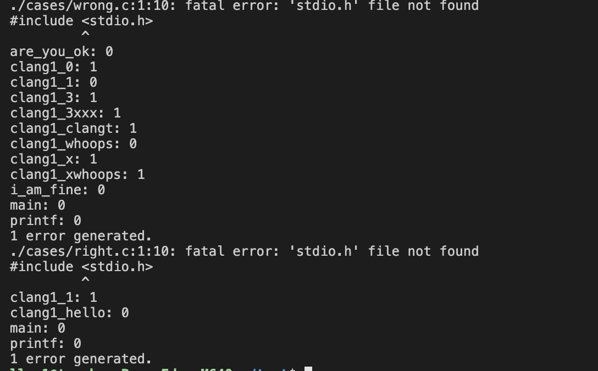

[TOC]

# 编译原理研讨课实验PR001实验报告

## 任务说明

* 了解llvm框架的整体构成与工作流程，熟悉Clang的编译、安装与使用流程：

  * 从下载源码到编译安装llvm和Clang
  * 了解如何生成和查看C程序对应的AST

* 在前端添加`elementWise`操作的制导，使编译器能够正常识别`#pragma elementWise`，并能够将信息从Lexer传递给Parser/Sema，在几部分的协同工作下最终修改AST中与该制导操作对应的相应属性，使得解析AST时能够正确处理该制导。

* 对于添加了制导的源程序 *.c ，按照规则在编译时打印每个函数的名称，该函数是否在制导范围内。 对于一个函数的是否在制导范围内的定义:

  * 区域以函数/过程的定义（不是声明）为单位，形如

    ```c
    #pragma elementWise
    void func_name(){
    	...
    }
    ```

  * 一个制导总是匹配在其后出现的，离它最近的一个函数定义
  * 一个制导最多只能匹配一个函数定义

## 成员组成

* 蔡润泽：2017K8009908018
* 燕澄皓：2017K8009915041

## 实验设计

### 设计思路

在设计的时候按照**从前到后、自顶向下**分析的思路进行。即按照编译器前端工作的流程一步步分析我们在每个阶段需要实现什么功能，而为了达到这一效果我们又需要进一步做哪些工作来添加支持，这样层层递进地进行分析。

* ##### 1. 在Lexer中应该能识别并正确处理该Pragma

  * 当Lexer认出`#pragma`的时候，将调用`PragmaNamespace::HandlePragma()`函数来处理该Pragma。要处理的Pragma种类记录在Token中，以参数的形式传递给该函数。
    * 例如在该实验中，我们要添加的制导为`#pragma elementWise`，那么Token就可以为“elementWise”。
  * 函数在处理时会根据Token内的信息寻找其对应的Handler，并对Handler进行调用，来完成真正的处理流程。调用方式：`Handler->HandlePragma(PP, Introducer, Tok);`

  **至此，我们意识到我们应该注册elementWise的Handler，并实现其`HandlePragma`函数。**


* ##### 2. 定义elementWise的Handler，并在Parser中将其实例注册给预处理器

  * 先在`ParsePragma.h `中定义`PragmaElementWiseHandler`类，继承自父类` PragmaHandler`，它有自己的处理函数`HandlePragma`。

  * 将Handler添加给编译器的预处理器：

    * 定义一个Handler的唯一实例。

    * 在Parser的构造函数中将该实例注册给预处理器（也要在析构函数中将其移出）。

  
**至此，Lexer部分需要添加的支持已经完毕，我们要实现具体的处理函数`Handler->HandlePragma`**


* ##### 3. 实现`Handler->HandlePragma`函数

  * 判断是否是合法的elementWise的Pragma，按照我们的要求，合法的制导只能形如`#pragma elementWise`。
  * 如果合法，我们要生成一个新的Token，并在该Token中填入相应的语义信息，将这个Token塞入到编译器处理的Token流之中，由后续的Parser/Sema部分来处理相应的语义信息。
    * 定义elementWise的Token：`ANNOTATION(pragma_element_wise)`
    * 填充语义信息

  **至此，我们已经从合法的`#pragma elementWise`得到了一个`tok::annot_pragma_element_wise`的*Token*，接下来需要语法以及语义分析的部分来正确处理该*Token*。**

  **为了能够正确处理该*Token*，我们首先要在语义部分以及函数定义中添加相应的字段来记录制导信息。相应地，我们需要set/get方法来设置/获取该字段。**

  

* ##### 4. 在*Sema*以及*Decl*中添加包含制导信息的字段，以及相应的*set/get*方法

  * 在`Sema.h`中添加`int ElementWiseOn`字段，表明`elementWise`类型，在这里具体对应是否开启该制导,其中`1`代表开启`elementWise`。
  * 在`Decl.h`中：
    * 添加`bool IsElementWise`字段，表明是否开启该制导；
    * 添加`setElementWise()`以及`isElementWise()`这一对*set/get*方法，来设置/获取该字段。

  **我们接下来考虑如何将该*Token*的信息传递给语义部分，并进一步传递到具体的函数定义上，完成相应字段的设置**

  

* ##### 5. 传递*Token*信息到*Sema*语义部分

  * 在*Parser*中添加函数`Parser::HandlePragmaElementWise`，它会调用`ActOnPragmaElementWise`将信息传递给*Sema*。
  * `Sema::ActOnPragmaElementWise`根据传递进来的信息，完成`Sema::ElementWiseOn`字段的设置。

  **至此，从*Parser*到*Sema*的代码已经写好，剩下的需要为`HandlePragmaElementWise`添加相应的调用**

  

* ##### 6. 在解析语法树的核心调用中为上述函数添加调用点：

  * 调用发生在`Parser::ParseExternalDeclaration`中，这是一个前端的核心调用之一。
  * 在*switch-case*语句中添加`tok::annot_pragma_element_wise`这一新的*case*，并完成`HandlePragmaElementWise`的调用即可。

  **至此，*Token*中的信息已经正确记录在*Sema*中。由于一个制导仅对应其后的唯一一个函数定义，因而这个制导的信息应该专属于一个函数的定义。所以我们意识到应该在一个函数定义结束时，将Sema中的信息传递到该函数定义之中。**

  

* ##### 7. 将制导信息从语义部分传递给函数定义

  * 产生函数定义的时候，根据*Sema*中的制导信息，调用*Decl*中相应的*set*方法来设置函数定义*Decl*中的制导信息。

  **至此，为正确识别该制导，在前端所要添加的支持已经全部完成，编译器理应能正确识别并该制导选项。我们需要在老师给定的输出插件中添加相应的打印语句，即可判断前端是否正确处理了新添加的制导**

  

* ##### 8. 在输出插件中添加打印语句，用于验证前端是否正常工作

### 实验实现

以下根据设计思路部分的流程，来对我们代码中的一些关键实现做以说明。

* ##### 2. 定义elementWise的Handler，并在Parser中将其实例注册给预处理器

  实例创建以及注册的部分在此省略，下面展示`PragmaElementWiseHandler`这个新定义的类。

  文件位于：`file:llvm-master/tools/clang/lib/Parse/ParsePragma.h `，代码实现如下：

  ```cpp
  class PragmaElementWiseHandler : public PragmaHandler {
  public:
    explicit PragmaElementWiseHandler() : PragmaHandler("elementWise") {}
  
    virtual void HandlePragma(Preprocessor &PP, PragmaIntroducerKind Introducer,
                              Token &FirstToken);
  }
  ```

* ##### 3. 实现`Handler->HandlePragma`函数：

  文件位于： `file:llvm-master/tools/clang/lib/Parse/ParsePragma.cpp `，代码实现如下：

  ```cpp
  void PragmaElementWiseHandler::HandlePragma(Preprocessor &PP, 
                                       PragmaIntroducerKind Introducer,
                                       Token &ElementWiseTok) {
  
      PP.CheckEndOfDirective("pragma elementWise");
      Token *Toks =
        (Token*) PP.getPreprocessorAllocator().Allocate(
          sizeof(Token) * 1, llvm::alignOf<Token>());
      new (Toks) Token();  
      Toks[0].startToken();
      Toks[0].setKind(tok::annot_pragma_element_wise);
      Toks[0].setLocation(ElementWiseTok.getLocation());
      Toks[0].setAnnotationValue(NULL);
      PP.EnterTokenStream(Toks, 1, /*DisableMacroExpansion=*/true,
                          /*OwnsTokens=*/false);
  }
  ```

* ##### 4. 在*Sema*以及*Decl*中添加包含制导信息的字段，以及相应的*set/get*方法

  文件位于：`file:llvm-master/tools/clang/include/clang/Sema/Sema.h`，代码实现如下：

  ```cpp
  /// ElementWiseOn - 1 when \#pragma elementWise on
  int ElementWiseOn;
  
  /// ActOnPragmaElementWise - Called on well formed \#pragma elementWise.
  void ActOnPragmaElementWise();
  ```

  文件位于：`file:llvm-master/tools/clang/include/clang/AST/Decl.h`，代码实现如下：

  ```cpp
  // IsElementWise
  // Decl contains elementWise or not
  bool IsElementWise : 1;
  
  ...
  
  /// setElementWise -- Set elementWise for this specific
  /// definition
  void setElementWise(bool ElementWiseOn);
  bool isElementWise() const {return IsElementWise;}
  ```

  

* ##### 5. 传递*Token*信息到*Sema*语义部分

  文件位于`file:llvm-master/tools/clang/lib/Parse/ParsePragma.cpp`，代码实现如下：

  ```cpp
  void Parser::HandlePragmaElementWise() {
      assert(Tok.is(tok::annot_pragma_element_wise));
      SourceLocation PragmaLoc = ConsumeToken();
      Actions.ActOnPragmaElementWise();
  }
  ```

  文件位于`file:llvm-master/tools/clang/lib/Sema/SemaAttr.cpp`，代码实现如下：

  ```cpp
  void Sema::ActOnPragmaElementWise(){
      ElementWiseOn = 1;
  }
  ```

* ##### 6. 在解析语法树的核心调用中为上述函数添加调用点：

  文件位于`file:llvm-master/tools/clang/lib/Parse/Parser.cpp`，代码实现如下：

  ```cpp
  Parser::ParseExternalDeclaration(ParsedAttributesWithRange &attrs,
                                   ParsingDeclSpec *DS) {
  		...
      switch (Tok.getKind()) {
      /*add entry point here*/
      case tok::annot_pragma_element_wise:
          HandlePragmaElementWise();
          return DeclGroupPtrTy(); 
       ...
    	}
    ...
  }
  ```

* ##### 7. 将制导信息从语义部分传递给函数定义

  文件位于`file:llvm-master/tools/clang/lib/Sema/SemaDecl.cpp`，代码实现如下：

  ```cpp
  Decl *Sema::ActOnFinishFunctionBody(Decl *dcl, Stmt *Body,
                                      bool IsInstantiation) {
  	...
    if (FD) {
      FD->setBody(Body);
  
      // Handle elementWise
      if (ElementWiseOn == 1) {
        FD->setElementWise(true);
        ElementWiseOn = 0;
      } else {
         FD->setElementWise(false);
      }
      ...
    }
    ...
  }
  ```

* ##### 8. 在输出插件中添加打印语句，用于验证前端是否正常工作

  文件位于`file:llvm-master/tools/clang/examples/TraverseFunctionDecls/TraverseFunctionDecls.cpp`，代码实现如下：

  ```cpp
  class TraverseFunctionDeclsVisitor
      : public RecursiveASTVisitor<TraverseFunctionDeclsVisitor> {
  public:
      explicit TraverseFunctionDeclsVisitor(ASTContext *Context)
          : Context(Context) {}
          
      bool TraverseDecl(Decl *DeclNode) {
          if (DeclNode == NULL) {
              return true;
          }
          if (const FunctionDecl *FD = dyn_cast<FunctionDecl>(DeclNode)) {
              std::string name = FD -> getNameAsString();
              bool IsElementWise = FD -> isElementWise();
              if (IsElementWise) {
                  funcNamesToIsElementWise[name] = true;
              } else {
  				std::map<std::string, unsigned>::iterator it = \	funcNamesToIsElementWise.find(name);
  				if(it == funcNamesToIsElementWise.end())
  					funcNamesToIsElementWise[FD->getNameAsString()] = FD -> isElementWise();
              }
          }
          return RecursiveASTVisitor<TraverseFunctionDeclsVisitor>::TraverseDecl(DeclNode);
      }
      
      
      void OutputIsElementWise() {
          for(std::map<std::string, unsigned>::iterator it = funcNamesToIsElementWise.begin(); it != funcNamesToIsElementWise.end(); ++it) {
              llvm::outs() << it -> first << ": " << it -> second << "\n";
          }
      }
      
  private:
      ASTContext *Context;
      std::map<std::string, unsigned> funcNamesToIsElementWise;
  };
  ```

## 总结

### 实验结果总结

根据老师给的测试代码，本程序分别于运行两个测试程序，得到的结果如下：



其中提到的头文件找不到的错误与实验环境配置有关，跟本次代码的实现无关。打印输出的0、1结果是本次代码测试的重点。

与`example_result.log`对比，两者输入的0、1结果一致，即对于`#pragma elementWise`的分析处理结果一致。

测试代码`right.c`如下，其中`clang1_1`在函数定义前有`#pragma elementWise`，因此该函数打印输出的结果为1，其他函数的结果为0。

```c
#include <stdio.h>
#include <stdlib.h>

int clang1_hello(int argc) {
    int b = argc;
    int c = argc + b;
    argc = b + c;
    return argc;
}
#pragma elementWise
int clang1_1(int argc) {
    int b = argc;
    int c = argc + b;
    argc = b + c;
    return argc;
}


int main(int argc, char **argv) {
    printf("Hello: clang1, case: 1\n");
    return 0;
}
```

测试代码`wrong.c`如下，其中:

- `clang1_1`在函数声明前有`#pragma elementWise`，但pragma只对函数定义有效，因此其不为0。

- `clang1_3xxx`在函数定义前有`#pragma elementWise rule1`是无效的`#pragma elementWise`语句，但是会和`clang1_1`前的`#pragma elementWise`匹配。因此`clang1_3xxx`输出结果为1。

- `clang1_whoops`会和`clang1_3xxx`前的`#pragma elementWise`匹配。因此`clang1_whoops`输出结果为1。

-  `clang1_clangt`在函数声明前有`#pragma elementWise`，但pragma只对函数定义有效，因此其结果为0。

- `clang1_x`在函数声明前有`#pragma elementWise`,因此输出结果为1。

- `are_you_ok`是函数声明，虽然前两行有`#pragma elementWise`，但其结果为0。

- `i_am_fine`是函数声明，虽然前三行有`#pragma elementWise`，但其结果为0。

- `clang_1_3`是函数定义，和之前的`#pragma elementWise`相匹配，其结果为1。

- `clang1_0`在函数定义前两行有`#pragma elementWise`，其结果为1。

- `clang1_xwhoops`在函数定义前的结构体前面有`#pragma elementWise`，其结果为1。

另外`main`和`printf`结果为0。

```c
#include <stdio.h>
#include <stdlib.h>

#pragma elementWise
int clang1_1(int argc);

#pragma elementWise rule1
int clang1_3xxx(int argc) {
    int b = argc;
    int c = argc + b;
    argc = b + c;
    return argc;
}
#pragma elementWise
int clang1_whoops(int argc);

int clang1_clangt(int argc) {
    int b = argc;
    int c = argc + b;
    argc = b + c;
    return argc;
}
#pragma elementWise
int clang1_x(int argc) {
    int b = argc;
    int c = argc + b;
    argc = b + c;
    return argc;
}

#pragma elementWise
int a = 0;
float are_you_ok(double argc);
float i_am_fine(double argc);
int clang1_3(int argc) {
    int b = argc;
    int c = argc + b;
    argc = b + c;
    return argc;
}

#pragma elementWise
typedef int int32_t;
int clang1_0(int argc) {
    int b = argc;
    int c = argc + b;
    argc = b + c;
    return argc;
}

#pragma elementWise
struct History {
    int yesterday;
    double today;
    char tommorow;
};
int clang1_xwhoops(int argc) {
    int b = argc;
    int c = argc + b;
    argc = b + c;
    return argc;
}

int main(int argc, char **argv) {
    printf("Hello: clang1, case: 3\n");
    return 0;
}
```

### 分成员总结

#### 蔡润泽

本次实验主要负责实验代码的书写。这是我第一次接触大型的开源工程源码，面对庞大的代码量，我刚开始看到各种各样的文件夹分布、相似的文件名和函数名有些不知所措。不过幸好后期有老师的帮助，我们可以对照着项目的说明书，一步一步的对照着`asCheck`的实现，完成任务一。有了说明的帮助，整个代码在理解编译的过程后，实现起来非常的快。

另外本次对于ssh环境的使用、私有服务器的gitlab的使用，以及和VS Code的搭配让我学到了很多知识，这也对以后我进行服务器端的编程开发工作帮助很大。


#### 燕澄皓

本次实验主要负责实验报告的撰写，辅助进行代码的版本管理及调试。面对体量如此庞大的开源项目，想要弄清源码中各组件之间的关系以及项目运行的流程是十分困难的。但是对照着老师给出的示例，结合着理论课上学习到的知识和自己的思考，终于较为直观地体会到了整个前端部分是如何配合工作的，理论课上学习到的知识也终于有了实际落地的感觉。

通过此次实验，使得我对理论课的知识有了更为深刻的认识。同时此次实验也加深了我对git workflow的理解与掌握，我能够更为自如地使用git进行版本管理与协作开发。

